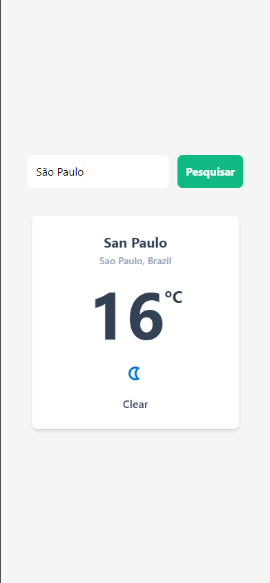
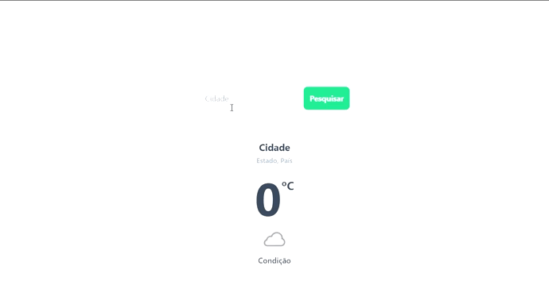

# ☀️ Weather App

Aplicativo para visualizar o clima de uma cidade, pesquisando pelo seu nome.

## 🚀 Instalação

Clone o projeto

```bash
  git clone https://github.com/quinamilena/weather-app.git
```

Entre no diretório do projeto

```bash
  cd weather-app
```

Instale as dependências

```bash
  npm install
```

Inicie o servidor

```bash
  npm run start
```

## Screenshots




## 💻 Demonstração

Pesquise o nome de uma cidade no campo de pesquisa.



## 👩‍💻 Stack utilizada

**Front-end:** React, TailwindCSS

**Back-end:** [weather api](https://www.weatherapi.com/)

## Licença

[MIT](https://choosealicense.com/licenses/mit/)
